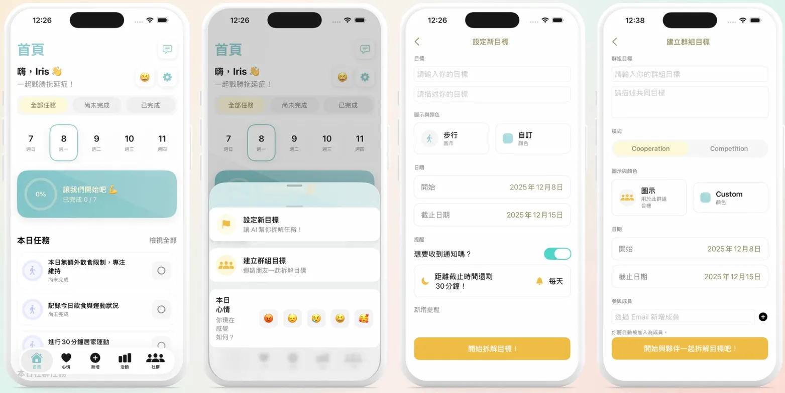
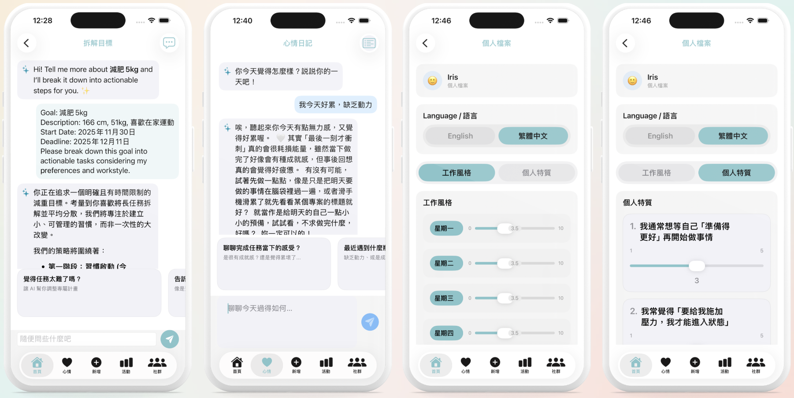

# Anti-delay Lab

> An AI-powered iOS app that helps users overcome procrastination through personalized task breakdown and CBT-based mood journaling.

[繁體中文版](README_zh.md)

---

## 📱 Demo

[▶ Watch Demo](https://drive.google.com/drive/folders/1mB_a2rfpdAPlwQXGwFGSt1mypumTbJyE)

---

## ✨ Features

### 🎯 AI Goal Breakdown `⭐ My Work`
Enter a goal and let Gemini AI break it down into actionable daily tasks — personalized based on your procrastination type, work schedule, and focus span. Adjust the plan through ongoing conversation.

### 💬 Mood Journal `⭐ My Work (UI + API integration)`
A CBT-inspired chat interface where the AI responds like a supportive friend — offering emotional validation, cognitive reframing, and small behavioral experiments tailored to your procrastination archetype. *(Prompt designed by teammate)*

### 🏠 Home Dashboard `⭐ My Work`
View today's tasks, track daily progress with a visual ring, and get personalized motivational banners based on your procrastination type and current completion rate.

### 👤 Profile & Preferences `⭐ My Work`
Onboarding questionnaire to identify your procrastination archetype (Perfectionist / Deadline Fighter). Customize work schedule, focus span, and language (English / 繁體中文).

### 👥 Group Goals `Teammate`
Create shared goals with friends in Cooperation or Competition mode. Track each other's progress in real time.

### 📊 Activity `Teammate`
Weekly and monthly task completion charts with mood trend visualization.

---

## 🖼️ Screenshots

| Home & Add Goal | AI Breakdown & Mood Journal & Profile|
|---|---|
|  |  |

---

## 🧠 My Contributions

This is a 3-person team project. My responsibilities:

| Area | Details |
|------|---------|
| **Frontend UI** | HomeView, BreakDownGoalView, JournalView, ProfileView, shared UIComponents library |
| **Gemini API Integration** | `GeminiService.swift` — Firebase AI (Gemini 2.5 Flash Lite), JSON parsing, code fence cleanup, date clamping, daily task limit logic |
| **Task Breakdown Prompt Design** | Designed and iterated differentiated prompt strategies by procrastination archetype (see Prompt Engineering section) |
| **Task Breakdown Feature** | Goal creation → AI breakdown → subtask sync to database |
| **Mood Journal API Integration** | Integrated Gemini API into the mood journal chat interface *(Prompt designed by teammate)* |

---

## 🏗️ Architecture

```
procrastination/
├── GeminiService.swift       # Gemini API integration & prompt logic
├── HomeView.swift            # Home dashboard
├── BreakDownGoalView.swift   # AI goal breakdown chat UI
├── JournalView.swift         # Mood journal
├── ProfileView.swift         # Profile & preferences
├── UIComponents.swift        # Shared UI components
├── Models.swift              # Global data models & shared extensions
├── Store.swift               # AppStore global state
├── SupabaseRepository.swift  # Cloud database operations
├── AuthService.swift         # Auth (login / register)
└── ContentView.swift         # Root routing (Auth → Onboarding → Main)
```

### Tech Stack

| Technology | Purpose |
|------------|---------|
| **SwiftUI** | All UI |
| **Firebase AI (Gemini 2.5 Flash Lite)** | Task breakdown & mood journal AI responses |
| **Supabase** | User auth & cloud data sync |
| **MarkdownUI** | Markdown rendering for AI replies |

---

## 🤖 Prompt Engineering

The core challenge was getting the AI to produce a plan the user can actually execute — not just a generic list of steps, but something calibrated to their psychological state.

### Personalization Inputs

Every Gemini call includes the following user data:

```
- Procrastination archetype (Perfectionist / Deadline Fighter)
- Daily available hours (Mon–Sun, individually set)
- Preferred focus span (< 15 min / 15–30 min / 30–60 min / > 1 hr)
- Psychological trait scores (1–5): perfectionism, start anxiety, deadline dependency
- Task scheduling preference, work-life balance habit
- Deadline and today's date
```

### Archetype-Differentiated Strategies

**Perfectionist**
- The first task is always a low-barrier "ugly draft" — titles deliberately include words like "rough", "草稿", "B-minus version" to reduce start resistance
- A first draft must appear within the first 30–40% of the time window to avoid back-loading
- Final days contain only light polishing / submission tasks — no heavy lifting

**Deadline Fighter**
- The first task is a micro-step (5–15 min) focused purely on breaking inertia
- Multiple artificial "mini deadlines" are placed well before the real deadline to distribute the sprint across days
- Task titles emphasize action: "Start now", "Write 3 lines", "Stage 1 deadline"

### Output Format Control

Gemini is instructed to return raw JSON:

```json
{
  "chatReply": "Strategic coaching message for the user (~150–250 chars)",
  "tasks": [
    {
      "title": "Task name",
      "isCompleted": false,
      "dueDate": "YYYY-MM-DD",
      "estimatedDuration": "25 min"
    }
  ]
}
```

`chatReply` follows a defined structure: one insight explaining the *why* behind the plan, a 3-phase roadmap (each phase with a creative name), and a closing nudge.

### Client-Side Post-Processing

LLMs occasionally generate dates outside the valid range or cluster too many tasks on one day. A post-processing step handles this on the client:

```swift
// 1. Date clamping: ensures all dates fall within today ~ deadline
// 2. Daily cap: tasks exceeding maxTasksPerDay are merged into a Bundle
decoded.tasks = postProcessTasks(decoded.tasks, start: today, end: deadlineDate, maxPerDay: 3)
```
